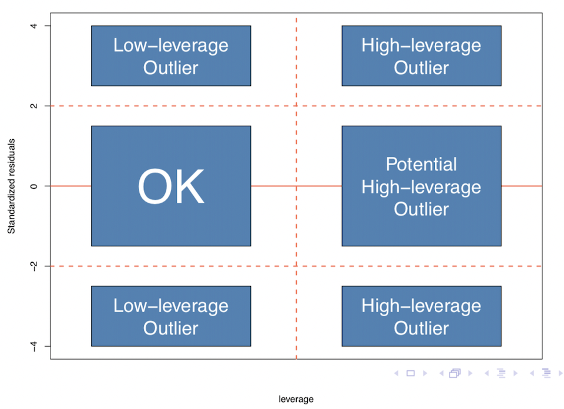

```{r setup, include=FALSE}
knitr::opts_chunk$set(echo = TRUE)
```

## Data Issues
```{r}
educ.df <- read.table("educ.txt", header=TRUE)
educ.lm <- lm(educ~percap+under18+urban, data=educ.df)
```
#### High Leverage Points
The hat matrix converts the observed values Y into the fitted values $\hat{\mu}$. The average hat matrix diagonals $h_{ii}$ = (k + 1)/n, so $h_{ii}’s$ greater than 5(k + 1)/n or even 3(k + 1)/n are considered large to to have a big impact on the fitted model.
```{r}
hmds <- influence(educ.lm)$hat ## hatvalues(GLM)
hii = ncol(educ.df)/nrow(educ.df)
(hmds[which(hmds>3*hii)])
```

#### Outliers
The outliers are observations with large error terms (residuals) where the value of the response is unusual given the values of the explanatory variables.
```{r}
educ.res = residuals(educ.lm)
library(MASS)
educ.stdres = stdres(educ.lm) ## Standardised Residuals
educ.studres = studres(educ.lm) ## Studentised Residuals
## Deviance Residuals: residuals(GLM, type="deviance")
## Pearson Residuals: residuals(GLM, type="pearson")
```

#### Influential Points
The cook distance considers the overall change in β when the i observation is removed: 0.5 indicates a potential HLP, and 1 indicates an HLP (often as the result of an observation that is both an outlier and a high leverage point)
```{r}
cd <- cooks.distance(educ.lm) ## The method applies to GLM as well
(cd[which(cd>=0.5)])
```

Plots for LM or GLM are:

1. Residuals vs fitted values.
2. A Normal Q-Q plot of the standardized residuals.
3. Square root of the absolute values of the standardized residuals vs fitted values.
4. An index barchart of Cook’s distance.
5. Standardized residuals vs leverage (HMD’s).
6. Cook’s distance vs leverage/(1-leverage).
```{r}
par(pty = "s", mfrow = c(2, 3))
plot(educ.lm, 1:6)
```

where leverage vs. residuals plot (the 5th plot) can be interpreted as: 

#### Multicollinearity
Variance Inflation Factor (VIF) represents the amount that Var(βj) is inflated due to the correlation between Xj and the remaining regressors.

+ values of 1 indicate a regressor that is orthogonal to all other regressors (i.e. independent)
+ values of 5 or more indicate multicollinearity.
+ values of approximately 10 or more indicate serious multicollinearity.
```{r}
Xmat <- model.matrix(educ.lm)[,-1] ## Remove the response variable
diag(solve(cor(Xmat)))
```

## Model Assumptions
#### Box-Cox Plots for Transforming Response
A Box-Cox plot is a convenient method of assessing whether or not transforming the response will be useful. For different values of λ fit the model and calculate the log-likelihood, then plot the values of the log-likelihood versus λ – the maximum value of the log-likelihood corresponds to the value of λ that results in the model that best fits the data.

$Y^{\lambda}=\beta_0 + \beta_1x_1 + \beta_2x_2 + ... + \beta_kx_k$

```{r}
boxcox(educ.lm)
```

+ Choose a value of λ that corresponds to a value of the log-likelihood that is close to the maximum value.
+ λ = 0 represents a log transformation.

#### GAMs for Transforming Regressors
General Additive Models (GAMs) can be used to explore the nature of the curvature in the regression surface

$Y = g_1(x_1) + g_2(x_2) + g_3(x_3) + ... + g_k(x_k) +  \epsilon$

```{r}
library(mgcv)
budworm.df <- read.table("budworm.txt", header=TRUE)
budworm.gam <- gam(cbind(s, n-s)~ sex + s(dose, k=3), family=binomial, data=budworm.df)
plot(budworm.gam, residuals=T, pages=1, pch=20)
```

+ The transformations can be set to be “smoothers”
+ Plots of the smoothers suggest suitable transformations for the explanatory variables